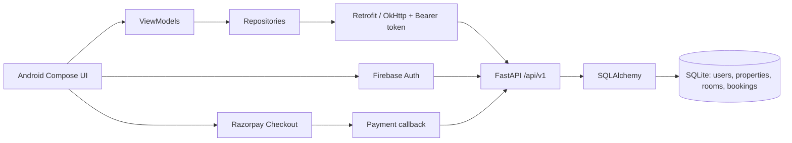

# HostelDekho end-to-end integration audit

## Architecture

## Verified connected UI flows

| UI | Endpoint | Tables | Status |
|---|---|---|---|
| Login / Google / phone OTP | `POST auth/login`, `auth/firebase` | users | Connected |
| Register | `POST auth/register` | users | Connected |
| Profile / personal information | `GET/PUT auth/me` | users | Connected |
| Landing / search / detail | `GET properties/nearby`, `search`, `/{id}` | properties, rooms | Connected |
| Add property | `POST properties/` | properties, rooms | Connected; owner role now required |
| Student bookings | `POST bookings/`, `GET bookings/my` | bookings, rooms | Connected |
| Owner listings / bookings / stats | `GET properties/my`, `bookings/owner`, `owner/stats` | properties, rooms, bookings | Connected; owner/admin role now required |
| Razorpay verification | `POST payments/verify` | bookings, rooms | Fixed: callback is now delivered to Compose and server validates ownership |

## Static or missing integrations

| UI / capability | Status | Missing backend capability |
|---|---|---|
| Bank details, business information | Static form | Bank/payout model and API |
| KYC upload | Static | File upload, KYC document table/workflow |
| Complaint / help contact | Static | Ticket model/API |
| Notifications | Static | Notification model/API and push delivery |
| Wishlist, followed/shared hostels | Empty/static | User-property relation APIs |
| Refunds / Paytm page | Static | Payment/refund provider APIs and webhooks |
| Language and security settings | Local/static | Preference and password/session APIs |
| Owner analytics and payments tabs | Static/dummy chart data | Analytics and transaction APIs |
| Admin, faculty, password reset, role change, delete/update property | Not implemented | Routes, screens, audit trail |

## Changes made during audit

- Added server-side owner/admin and student authorization checks.
- Blocked payment verification by anyone except the booking owner; made it idempotent.
- Validated booking room/property ownership and inactive properties.
- Added rollbacks for property, booking, and payment database mutations.
- Made OTP debug output opt-in (`DEBUG_MODE=false` by default).
- Wired Razorpay's `PaymentResultWithDataListener` to the Compose booking screen, preserving the signature needed by server verification.

## Findings still requiring product work

- The nearby-property SQL uses `LEAST`, `GREATEST`, and trigonometric functions that may not be compiled into SQLite. Test this endpoint against the deployed database; use a portable distance query or geospatial database index for production.
- The current app signs every self-registered user up as `STUDENT`; therefore no supported owner-onboarding or role-change flow exists after owner authorization is enforced.
- No migrations, tests, rate limiting, refresh-on-401 behavior, password reset, audit log, uploads, or webhook handling are present.
- CORS uses `allow_origins=["*"]` together with credentials. Set explicit trusted origins before deploying a web client.
- Android clear-text HTTP is enabled and the debug Razorpay key is a placeholder. Use HTTPS and release secrets/configuration before production.

## Scores (source-audit estimate)

| Area | Score |
|---|---:|
| Frontend connected workflows | 45% |
| Backend API implementation | 60% |
| Database coverage | 45% |
| API contract alignment | 70% |
| Security | 48% |
| Automated test coverage | 0% |
| Production readiness | 35% |
| Overall integration | 47% |

## Verification constraints

`compileDebugKotlin` was started after configuring the bundled JDK, but this environment ended the Gradle task while resource processing was still in progress, before a compile result was emitted. FastAPI dependencies were absent; installing the pinned dependencies into an isolated temporary directory did not complete in this execution environment. No real external payment, Firebase, or database-server credentials were supplied, so those integrations were reviewed from source only.
